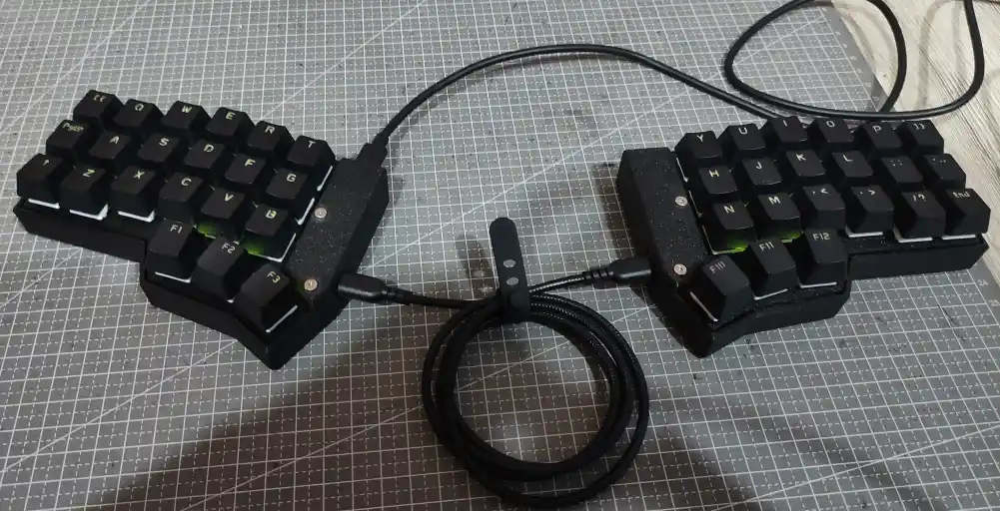
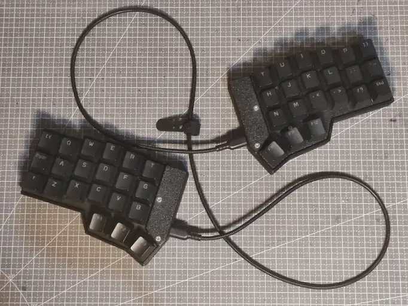

# Making a Handwired Split Keyboard

Hello! I just finished making myself a handwired split keyboard and I'd like to
tell you my journey in doing so

This write-up will have two versions: A longer story like version and a shorter 
rundown version

- **[The long version](long)**
- **[The short version](short)**

## The Final Result

{ height="512" loading=lazy }

{ height="512" loading=lazy }

## Cost Breakdown

| Part Name                   | Price/Piece (IDR) | Qty | Total Raw | Shipping & Other | Discount | Effective Total |
| :-------------------------- | ----------------: | --: | --------: | ---------------: | -------: | --------------: |
| RP2040-Zero                 |           54'000  |   1 |   54'000  |                  |          |                 |
| RP2040-Zero Replacement     |           41'000  |   1 |   41'000  |                  |          |                 |
| Kailh Hot Swap Sockets      |            1'300  |  42 |   54'600  |          26'500  |  24'000  |         57'100  |
| WS2812B                     |              760  |  42 |   31'920  |                  |          |                 |
| USB-C Breakout Board        |            2'995  |   2 |    5'980  |               -  |       -  |          5'980  |
| USB-C to USB-C Cable        |           16'866  |   1 |   16'866  |          24'000  |  20'844  |         20'022  |
| 3D Print Switch Plate       |              700  |  21 |   14'700  |          32'500  |  20'000  |         27'200  |
| 3D Print Case and Cover     |              600  | 144 |   86'400  |                  |          |                 |
| 1N4148 Diode                |              140  |  42 |    5'880  |                  |          |                 |
| Female Socket Headers 1x40  |            2'700  |   2 |    5'400  |               -  |       -  |          5'400  |
| M2x8 Hex Screws             |              700  |  16 |   11'200  |                  |          |                 |
| M2.5x14 Hex Screws          |              800  |   4 |    3'200  |               -  |       -  |          3'200  |
| M2x6x3.5 Threaded Insert    |              400  |   8 |    3'200  |               -  |       -  |          3'200  |
| M2.5x3x3.5 Threaded Insert  |              500  |   4 |    2'000  |               -  |       -  |          2'000  |
| Rubber Feet 8x2mm           |              300  |   8 |    2'400  |               -  |       -  |          2'400  |
| Silent Switch               |            1'596  |  42 |   63'822  |                  |          |                 |
| Keycap Set                  |                   |   1 |           |                  |          |                 |
| Total {colspan=3}                                     |  **402'568**  |                  |          |                 |

